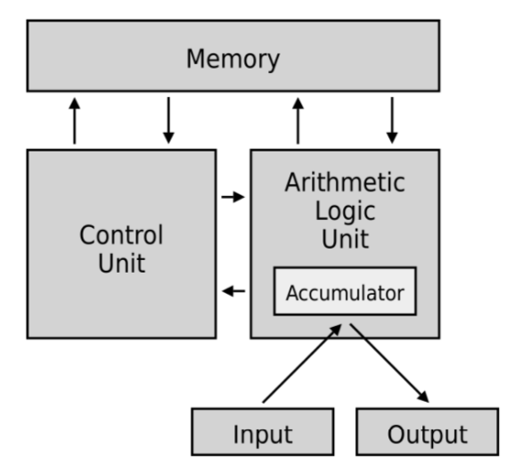

<h1 align="center"> Technical specification </h1>

<p align="center"> 
Created by: Aurélien FERNANDEZ <br> Creation Date: 17/01/2024 <br> Last update: 25/01/2024
</p>

___


<details>
<summary style="font-size:1.2em; font-weight:bold;">Table Of Content:</summary>

- [0. Last reviewer](#0-last-reviewer)
- [1. Introduction](#1-introduction)
  - [1.1 Project goal](#11-project-goal)
- [2. File architecture](#2-file-architecture)
- [3.Developmnent environment](#3developmnent-environment)
- [4. Conventions](#4-conventions)
  - [4.1 Commits](#41-commits)
    - [4.1.1 Title:](#411-title)
    - [4.1.2 Body:](#412-body)
    - [4.1.3 Additional keywords:](#413-additional-keywords)
    - [4.1.4 Examples:](#414-examples)
  - [4.2 Files](#42-files)
  - [4.3 Names](#43-names)
  - [4.4 Comments](#44-comments)
    - [4.4.1 Example:](#441-example)
- [6. Components of the project](#6-components-of-the-project)
- [6.1 CPU architecture](#61-cpu-architecture)
- [6.2 Parser\[^7\]](#62-parser7)
- [7. Footnotes](#7-footnotes)
  
</details>

## 0. Last reviewer
|    Collaborator    |    Date    |
| :----------------: | :--------: |
| Aurélien Fernandez | 25/01/2024 |


## 1. Introduction

### 1.1 Project goal

The goal of this project is to create our own virtual processor. Our processor should be able to read assembly instructions using our own dialect.

## 2. File architecture

```
Project
├── Documents
│  ├── Img
|  |   └──image.png*
│  ├── Management
|  |   └──Files/folders*
│  ├── Testing
|  |   └──Files/folders*
│  ├── TechnicalSpecifications.md
│  └── FunctionalSpecifications.md
└── Code
   ├──Headers
   |  └──name.h*
   ├── Main.h
   └── UnitTests.c
```

Where * means files and folders that may appear in the future.

## 3.Developmnent environment

Our team uses multiple machines to work on this project such as:
  - 3 Windows operating on Windows 11.
  - 3 MacBooks operating on MacOS Sonoma 14.

As for the IDE[^1], out of the 6 members of our team, 5 uses Visual Studio Code and 1 uses Visual Studio Codium. As they are extremely similar, we all uses the same extensions to run and debug C. All of these extensions are packed into one called
<a href="https://marketplace.visualstudio.com/items?itemName=ms-vscode.cpptools-extension-pack">C/C++ Extension Pack</a> .

To be able to run C we all installed the compiler <a href="https://gcc.gnu.org/">GCC</a>.

Finally, to avoid conflicts in terms of conventions, such as the naming conventions for functions,variables or other conventions. We chose to use these standards: <a href="https://users.ece.cmu.edu/~eno/coding/CCodingStandard.html">Mellon University's standards</a>. For the exception of names which we will use camelCase.
We choose these standards because it covers almost every aspect of c.
## 4. Conventions

The project's repository[^2] have to be organised to allow contributors and potential visitors to navigate through the repository without problems such as:
- Having trouble to find a specific file.
- Creating conflicts with pushes.
- Different naming standards between contributors.
- etc.
  
### 4.1 Commits

Commits must be written following these specific rules:

#### 4.1.1 Title:

The title is one of the most important thing is a commit, it serves to describe what the commit is about, and provide a quick summary of what is implemented/fixed/removed. As such, it has to follow few rules.

It has to begin with one of the following: 
- "feat:" if the commit implement a feature to the project.
- "fix:" if the commit fixes a bug encountered after an implementation.
- "chore:" if the commit is about a routine task, for example refactoring, it is mostly used to tasks that are neither features or fixes.
- "docs:" if the commit is about changes to a document or adding documents.
- "perf:" if the commit is about optimising of performances.

Furthermore a title shouldn't be more than 50 characters long and must describe the action of the commit, a verb and the name of the implementation or the name of the file involved.

#### 4.1.2 Body:

The body describes the commit with more details, and as titles it has to follow certain rules:
  - Provide context: explain why this change is needed.
  - If possible summarise how changes were applied, notably for implementations, fixes, refactoring or optimisation.
  - Reference issues if needed.
  - Avoid long paragraphs, list what has been done.
  - No jargon without explanations, other contributors must understand the commit.

#### 4.1.3 Additional keywords:

These keywords are not absolutely needed in one's commit but can enhance the project's organisation and allow collaborators[^3] to hit two birds with one stone in multiple cases. 

Git/Github desktop:

These lines are to be added at the end of the body of a commit. 
  ```
  Close(s/d)/Fix(es/ed)/resolve(s/d) (:) #[*issue id*]
  ```
  It closes the issue with this id, only one of the precedent words is necessary.
  ```
  Co-authored-by(:) [*Name*] [*colleague@example.com*]
  ``` 
   It adds a co-author to the commit, the name is not sensitive to collaborators on the contrary of the email address.

   For Github dekstop, the co author can be added by using this:

   

   ```
   commit(:) [*commit hashcode*]
   ```
   It is a link to a past commit.

#### 4.1.4 Examples:

For a feature:
```
Feat: implementation of multiplications

Implement a new feature to support multiplication operations in the calculator.

- Implementation of the multiplication algorithm.
- Update user interface to include multiplication.
- Add unit test related to multiplications.

This feature enhance the usability of the calculator, providing users with a new set of operations.
``` 
For a fix committed after the previous example:
```
Fix:  overflow with multiplication

fix an issue where the multiplication may create an overflow if the inputs are higher than expected (over a trillion).

see commit: 1a2b3c

- If one of the value is higher than the limit, divide it into two separate value.
- If a value is too high, represent it with exponent (1e10 is equal to 1x(10x10))

This fix allows users to apply multiplications to higher numbers without being subject to an overflow.

Closes: #324
``` 

### 4.2 Files

Files, and more precisely header[^4] files, should be divided into multiple files. A single file should not contains all functions. A header file should contain function one functionality.

Furthermore, header files should not depend on other header files. This will make maintenance more difficult than expected at first. This rule does not include standards headers. 

For example in a calculator project, there should be a structure similar to this one:
  - Calculator.c
  - Operations.h
  - Display.h
  - Input.h

### 4.3 Names

Names are extremely important to a project's readability[^5], not having conventions or having each collaborators of a projects using it's own conventions leads to deteriorate both the quality of the project and the overall readability.

For this project this set of naming conventions has been chosen:

- Branches: PascalCases, appart of the Main,PreMain,Documents, the branch is named after the name of the feature or after the name/id of the fix.
- Document/Folder/Files: PascalCases.

### 4.4 Comments

We are using standards to increase the readability of a code, but without comments reading a code can take a more time than expected and desired.

To be able to hand our code to other collaborator during this project, or for the maintenance of the project, comments are necessary. For this purpose this set of rules were made:

Every .c and .h files must have a "header comment". This comment will describe what does this file contains in a quick summary. We do not need to go too much into the details in this comment.

Then functions and defined elements must have a "function header". It is a multiline comment containing: 
  - A short description of the function.
  - Parameters needed to call the function, with their type and a short explanation of the variable.
  - The result of the function, it may be a sucess/failure output or describing what does the function do being (example: the function create/modify/remove a file).
  
Finally the components of a function must have a comment to explain in few words what it does.

If the IDE allows it[^6], the function header can be read by hovering the mouse on the name of the function.

**Beware, do not abuse of comments. A function shouldn't have a comment on every lines!**  

#### 4.4.1 Example:

```c
/* Filename.c
 * Author(1): My Name
 * Author(2): Another Name
 * Last update: XX/XX/20XX
 * 
 * Summary:
 * This file contains functions allowing the operations of the calculator.
 * It allows the calculator to perform: additions, substrations etc...
 * 
 */

/**
 * This definition calls the "sin" operation corresponding with the appropriate type.
 * @param x (double/float/long double): this is the value to perform the sin operation on.
 * @result (double/float/long double): The functions result either a double, a float or a long double depending of the level of precision needed.
 */
#define sin(x) _Generic((x), float:sinf,double:sin, long double: sinl)(X)

/**
 * This function multiply one int with another and return the result of the operation.
 * @param x (int): this is the first int.
 * @param y (int): this is the second int.
 * @result (int): The functions result an int which is the result of a multiplication.
 */
int intMultiplication(int x,int y)
{
  int result =x*y;//multiply x by y
  return result; 
}

/**
 * This function multiply one float with another and return the result of the operation.
 * @param x (float): this is the first float.
 * @param y (float): this is the second float.
 * @result (float): The functions result an float which is the result of a multiplication.
 */
float floatMultiplication(float x,float y)
{
  float result =x*y;//multiply x by y
  return result; 
}
```

## 6. Components of the project

## 6.1 CPU architecture

For this project we will follow the <a href="https://fr.wikipedia.org/wiki/Architecture_de_von_Neumann">Von Neumann architecture</a>, this architecture defines how a computer system works. It can be represented as the following:



Our CPU's architecture, the control unit in the previous image, will be different than the most popular architecture (x86, ARM,RISC-V,MIPS,etc). We are aiming for an educational purpose, thus we are aiming for simplicity.


## 6.2 Parser[^7]

To translate from Assembly language to machine code[^8] and compile the resulting machine code we need to be able to identify what is contained in a string[^9]. To achieve this we can create three different parsers. This is a schema of the parsers for our project.


To identify Assembly keywords and their equivalents we are using a mix of arrays and enumerators[^10].

For parsing from Assembly language to machine code we are using an array of characters to identify the instructions and registers/values:

```c
//This is an enumerator containing all of the instructions.
enum instructions
{
    CLF,
    CMP, CMPI, CMPF, CMPFI,
    MOV, MOVF,
    STI, STF, LDI, LDF,
    LII, LIF,
    PSH, POP,
    PSHF, POPF,
    INC, DEC,
    ADD, SUB, MUL, DIV,
    ADDF, SUBF, MULF, DIVF,
    JLZ, JGZ, JEZ, JNZ, JMP,
    SHL, SHR,
    BAND, BOR, BNOT, BXOR,
    LAND, LOR, LNOT,
    HLT,
};

//This is an array of 44 characters containing all instructions.
const char *instruction_strings[] = {
    "CLF",
    "CMP", "CMPI", "CMPF", "CMPFI",
    "MOV", "MOVF",
    "STI", "STF", "LDI", "LDF",
    "LII", "LIF",
    "PSH", "POP",
    "PSHF", "POPF",
    "INC", "DEC",
    "ADD", "SUB", "MUL", "DIV",
    "ADDF", "SUBF", "MULF", "DIVF",
    "JLZ", "JGZ", "JEZ", "JNZ", "JMP",
    "SHL", "SHR",
    "BAND", "BOR", "BNOT", "BXOR",
    "LAND", "LOR", "LNOT",
    "HLT"
    };
```

Then we are creating a new file with the translated assembly into machine code into it. It is an unreadable sequence of 0 and 1 gathered on a single line.

Finally our program parse a final time the binary file to execute it and output the result into a console. the result being what are inside the registers.

## 7. Footnotes

[^1]:IDE: Integrated Development Environment. This is an application or even a terminal allowing users to modify or to write a computer program.
[^2]:Repository: A repository is a folder (usually a project) stored both locally and in the cloud. A group of individuals can create, modify and delete a repository freely.
[^3]: olaborator: A collaborator is a person working on a repository.
[^4]: Header: A header file is a file used for C/C++ programs. It is used to declare functions and variables before executing a program.
[^5]: Readability: The readability is the ability to read a program without having problems to understand it's use or the goal of the functions/variables used.
[^6]: IDEs that allows this feature are: VScode/codium, Visual Studio Community, Eclipse, IntelliJ IDEA, PyCharm, Arduino IDE and multiple others.
[^7]: Parser: A Parser is a program that can split a chain of character to identify a specific syntax or specific keywords.
[^8]: Machine code: Machine code is the name given to the language of the computer, also named binary.
[^9]: String: A chain of character contained in one variable.
[^10]: Arrays and enumerators: An array is a data structure that store a fixed number of the same type of variable and an enumerator is a type of data that represent a sequence of value.