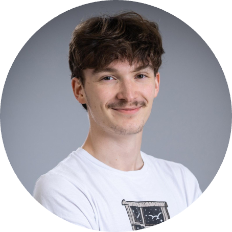
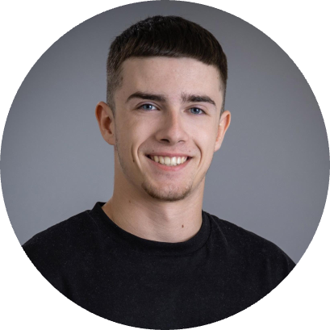
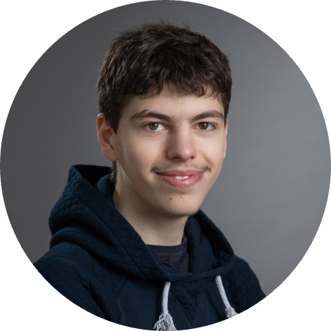
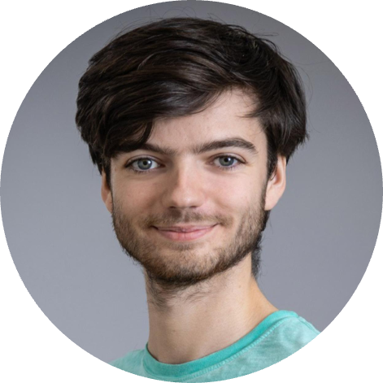
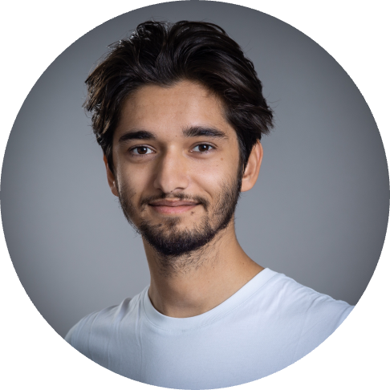
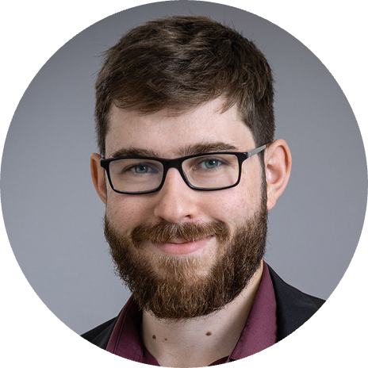

# ALGOSUP - 2023-2024 - Project 3 - Virtual Processor - Team 3

## Team Members
| **Photo** | **Name** | **Role** | **GitHub/LinkedIn** |
|---|---|---|---|
| | MARLIER Thibaud | Project Manager | [GitHub](https://github.com/Biohazardyee) \| [LinkedIn](https://www.linkedin.com/in/thibaud-marlier/) |
|  | CLEMENT Quentin | Program Manager | [GitHub](https://github.com/Quentin-Clement) \| [LinkedIn](https://www.linkedin.com/in/quentin-clément-939110221/) |
|  | FERNANDEZ Aurélien | Technical Leader | [GitHub](https://github.com/aurelienfernandez) \| [LinkedIn](https://www.linkedin.com/in/aurélien-fernandez-4971201b8/) |
|  | ARCHIMBAUD Malo| Software Engineer | [GitHub](https://github.com/Malo-Archimbaud) \| [LinkedIn](https://www.linkedin.com/in/malo-archimbaud-58aa12232/) |
|  | KAKAL Mathis | Software Engineer | [GitHub](https://github.com/mathiskakal) \| [LinkedIn](https://www.linkedin.com/in/mathis-k-a239ba10a/) |
|  | LEMOINE Arthur | Quality Assurance | [GitHub](https://github.com/arthur-lemo1ne) \| [LinkedIn](https://www.linkedin.com/in/arthur-lemoine-4b9782221/) |

## Overview

This project is an ALGOSUP project, driven by the students. This project aims to create a Virtual Processor along with an Assembly language. To run instructions on it. Moreover, we have to develop a built-in debugger. All of that, using plain and portable C language (only standard libraries are allowed).
