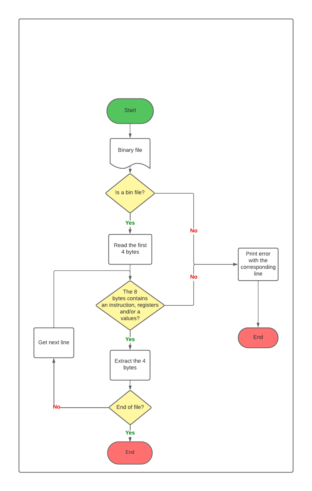

<div align="left"><a href="./"></a></div>
<br>

<h1 align="center"> Technical specifications </h1>

<p align="center"> 
Created by: Aurélien FERNANDEZ <br> Creation Date: 17/01/2024 <br> Last update: 05/02/2024
</p>

___


<details>

<summary>

## Table of content

</summary>

- [Table of content](#table-of-content)
- [0. Last reviewer](#0-last-reviewer)
- [1. Introduction](#1-introduction)
  - [1.2 Prior knowledge](#12-prior-knowledge)
- [2. File architecture](#2-file-architecture)
- [3. Development environment](#3-development-environment)
- [4. Conventions](#4-conventions)
- [4.1 Repository rules](#41-repository-rules)
  - [4.2 Commits](#42-commits)
    - [4.2.1 Title](#421-title)
    - [4.2.2 Body](#422-body)
    - [4.2.3 Examples](#423-examples)
  - [4.3 Files](#43-files)
  - [4.4 Names](#44-names)
  - [4.5 Comments](#45-comments)
    - [4.5.1 Example](#451-example)
- [5. Technical aspects](#5-technical-aspects)
  - [5.1 CPU architecture](#51-cpu-architecture)
  - [5.2 portability](#52-portability)
  - [5.3 Preprocessing](#53-preprocessing)
  - [5.4 Parsers](#54-parsers)
  - [5.5 Error handling](#55-error-handling)
  - [5.6 Execution](#56-execution)
- [6. Technical limitations](#6-technical-limitations)
- [7. Tests](#7-tests)
- [8. risks](#8-risks)
- [9. Maintenance](#9-maintenance)
  
</details>

## 0. Last reviewer

|    Collaborator    |    Date    |
| :----------------: | :--------: |
| Aurélien Fernandez | 05/02/2024 |

## 1. Introduction

The goal of this project is to create a virtual CPU and a compiler of our own assembly language. The language used to create both the CPU and the compiler must be made in C.

### 1.2 Prior knowledge

This document uses multiple technical terms and principles related to computer science. Thus this document is mainly written for:

- Software engineers,
- Current project collaborator,
- Reviewer possessing prior knowledge.

Additionally, before reading this document, please be aware that the ALGORISK assembly is explained in the functional specifications. We recommend reviewing that document first for a comprehensive understanding of the ALGORISK assembly.

## 2. File architecture


Legend:

- 🖼️Images
- 📖Documents
- 📕The ALGORISK assembly manual
- 📄Header file
- 📃C files
  
```
Project
├── 📁documents
│  ├── 📁img
│  |   ├── 📁img
|  |   |     ├── 🖼️assembler_diagram.png
|  |   |     ├── 🖼️back.png
|  |   |     ├── 🖼️back2.png
|  |   |     ├── 🖼️company_instructor.png
|  |   |     ├── 🖼️engineer.png
|  |   |     ├── 🖼️instruction_format.png
|  |   |     ├── 🖼️iot_woman.png
|  |   |     ├── 🖼️lexer_diagram.png
|  |   |     ├── 🖼️open_source_guy.png
|  |   |     ├── 🖼️promising_kid.png
|  |   |     ├── 🖼️retroplanning.png
|  |   |     ├── 🖼️script_kid.png
|  |   |     ├── 🖼️student1.png
|  |   |     └── 🖼️student2.png
|  |   ├── 🖼️co-authors-demo-hq.png
|  |   ├── 🖼️complete_Parser.png
|  |   ├── 🖼️multiplication.png
|  |   ├── 🖼️parser2FC.png
|  |   ├── 🖼️parser.png
|  |   ├── 🖼️von_neumann_architecture.png
|  |   └── 🖼️workflow.png
│  ├── 📁management
|  |   ├── 📁project_charter
|  |   |    └── 📖project_charter.md
|  |   ├── 📁RACI_chart
|  |   |    └── 📖RACI.md
|  |   ├── 📁risk_mitigation
|  |   |    └── 📖risk_mitigation.md
|  |   └── 📁weekly_report
|  |   |    ├── 📖Cumulative.md 
|  |   |    ├── 📖weekly_report1.md 
|  |   |    ├── 📖weekly_report2.md 
|  |   |    ├── 📖weekly_report3.md 
|  |   |    ├── 📖weekly_report4.md 
|  |   |    ├── 📖weekly_report5.md 
|  |   |    ├── 📖weekly_report6.md 
|  |   |    ├── 📖weekly_report7.md 
|  |   |    ├── 📖weekly_report8.md 
|  |   |    └── 📖weekly_report_template.md
|  |   └── management_artifact.md
│  ├── 📁testing
|  |   └── 📖test_plan.md
│  ├── 📕manual.pdf
│  ├── 📖technical_specifications.md
│  └── 📖functional_specifications.md
└── 📁code
   ├── 📁headers
   |  ├── 📄cpu.h 
   |  ├── 📄preprocessor.h
   |  ├── 📄assembler.h
   |  ├── 📄lexer.h
   |  └── 📄parser.h
   ├── 📃main.c
   └── 📃unit_tests.c
```
## 3. Development environment

Our team uses multiple machines to work on this project such as:

- 3 Windows operating on Windows 11.
- 3 MacBooks operating on MacOS Sonoma 14.

As for the IDE[^1], out of the six members of our team, five use  <a href="https://code.visualstudio.com/">Visual Studio code</a> Code, and 1 uses <a href="https://vscodium.com/">Visual Studio Codium</a>. As they are extremely similar, we are all using the same extensions to run and debug C. All of these extensions are packed into one called
<a href="https://marketplace.visualstudio.com/items?itemName=ms-vscode.cpptools-extension-pack">C/C++ Extension Pack</a>.

To be able to run C we all installed the compiler <a href="https://gcc.gnu.org/">GCC</a>.

Finally, to avoid conflicts in terms of conventions, such as the naming conventions for functions, variables, or other conventions. We chose to use <a href="https://users.ece.cmu.edu/~eno/coding/CCodingStandard.html"> Mellon University's standards</a>, except for names of files, functions and variables for which we use camelCase. We chose these standards because they cover almost every aspect of C.


## 4. Conventions

The project's repository[^2] has to be organized to allow contributors and potential visitors to navigate through the repository without problems such as:

- Having trouble finding a specific file.
- Creating conflicts with pushes.
- Different naming standards between contributors.
- Finding non-functional code inside the main branch or in releases.

## 4.1 Repository rules

  To ensure the quality of the code present both in the main branch and in releases
  we chose to apply rules. 
  
  First of all, the main branch is locked except for pull requests, this makes the branch safe for unwanted modifications. Each pull request requires the approval of at least one team member.
  
  Additionally, a branch named "Premain" has been created, the goal of this branch is to be sure any code that is meant to be pushed to the main branch is functional and does not carry bugs. Another rule is that any code inside the "Premain" branch has to be tested with unit tests and all of them must pass.

  The only branch that can bypass these rules is the branch "Documents", as it does not contain code.

### 4.2 Commits

Commits must be written following these specific rules, most of the rules can be found <a href="https://github.com/FlowingCode/DevelopmentConventions/blob/main/conventional-commits.md">here</a>.

#### 4.2.1 Title

The title is one of the most important things in a commit, it serves to describe what the commit is about and provide a quick summary of what is implemented/fixed/removed. As such, it has to follow a few rules.

It has to begin with one of the following:

- "feat:" if the commit implements a feature to the project.
- "fix:" if the commit fixes a bug encountered after an implementation.
- "chore:" If the commit is about a routine task, for example, refactoring, it is mostly used for tasks that are neither features nor fixes.
- "docs:" if the commit is about changes to a document or adding documents.
- "perf:" if the commit is about optimizing the performances.
- "remove:" if the commit removes a feature.

Furthermore, a title shouldn't be more than 50 characters long and must describe the action of the commit, a verb, and the name of the implementation or the name of the file involved.

#### 4.2.2 Body

The body describes the commit with more details, and as titles, it has to follow certain rules:

- Provide context: explain why this change is needed.
- If possible summarise how changes were applied, notably for implementations, fixes, refactoring, or optimization.
- Reference issues if needed.
- Avoid long paragraphs. Make a list of what has been done.
- No jargon without explanations. Other contributors must understand commits.
  
  The body can also contain specific keywords that can interact with the repository, such as adding co-authors, closing issues, etc. They can be found <a href="https://github.com/FlowingCode/DevelopmentConventions/blob/main/conventional-commits.md/#5-Footer">here</a> in the footer section.

#### 4.2.3 Examples

For a feature:

```
Feat: implementation of multiplications

Implement a new feature to support multiplication operations in the calculator.

- Implementation of the multiplication algorithm.
- Update user interface to include multiplication.
- Add unit test related to multiplications.

This feature enhance the usability of the calculator, providing users with a new set of operations.
```

For a fix committed after the previous example:

```
Fix:  overflow with multiplication

Fix an issue where the multiplication may create an overflow if the inputs are higher than expected (over a trillion).

see commit: 1a2b3c

- If one of the value is higher than the limit, divide it into two separate value.
- If a value is too high, represent it with exponent (1e10 is equal to 1x(10x10))

This fix allows users to apply multiplications to higher numbers without being subject to an overflow.

Closes: #324
```

### 4.3 Files

Files, and more precisely header[^3] files, should be divided into multiple files. A single file should not contain all functions. A header file should contain function one functionality.

Furthermore, header files should not depend on other header files. This is only making maintenance more difficult than expected at first. This rule does not include standard headers.

For example in a calculator project, there should be a structure similar to this one:

- calculator.c
- operations.h
- display.h
- input.h

### 4.4 Names

Names are extremely important to a project's readability[^4], not having conventions or having each collaborator of a project use its conventions leads to the deterioration of both the quality of the project and the overall readability.

For this project, this set of naming conventions has been chosen:

- Branches: PascalCases, apart from the Main, PreMain, and Documents, the branch is named after the name of the feature or after the name/id of the fix.
- Folder/Files: snake_case.

### 4.5 Comments

We are using standards to increase the readability of a code, but without comments reading a code can take more time than expected and desired.

To allow other collaborators to work on the code during this project, or for the maintenance of the project, comments are necessary. For this purpose this set of rules was made:

Every .c and .h file must have a "header comment". This comment describes what this file contains in a quick summary. We do not need to go too much into the details in this comment.

The functions and defined elements must have a "function header". It is a multiline comment containing:

- A short description of the function.
- Parameters needed to call the function, with their type and a short explanation of the variable.
- The result of the function, may be a success/failure output or describing what the function does (for example: the function creates/modifies/removes a file).
  
Finally, the components of a function must have a comment to explain in a few words what it does.

If the IDE allows it[^5], the function header can be read by hovering the mouse on the name of the function.

**Beware, do not abuse comments. A function shouldn't have a comment on every line!**  

#### 4.5.1 Example

```c
/* Filename.c
 * Author(1): My Name
 * Author(2): Another Name
 * Last update: XX/XX/20XX
 * 
 * Summary:
 * This file contains functions allowing the operations of the calculator.
 * It allows the calculator to perform: additions, substrations etc...
 * 
 */

/**
 * This definition calls the "sin" operation corresponding with the appropriate type.
 * @param x (double/float/long double): this is the value to perform the sin operation on.
 * @result (double/float/long double): The functions result either a double, a float or a long double depending of the level of precision needed.
 */
#define sin(x) _Generic((x), float:sinf,double:sin, long double: sinl)(X)

/**
 * This function multiply one int with another and return the result of the operation.
 * @param x (int): this is the first int.
 * @param y (int): this is the second int.
 * @result (int): The functions result an int which is the result of a multiplication.
 */
int intMultiplication(int x,int y)
{
  int result =x*y;//multiply x by y
  return result; 
}

/**
 * This function multiply one float with another and return the result of the operation.
 * @param x (float): this is the first float.
 * @param y (float): this is the second float.
 * @result (float): The functions result an float which is the result of a multiplication.
 */
float floatMultiplication(float x,float y)
{
  float result =x*y;//multiply x by y
  return result; 
}
```
## 5. Technical aspects

### 5.1 CPU architecture

For this project, we are following the Von Neumann architecture[^6]. This architecture defines how a computer system works. It can be represented as the following:


### 5.2 portability

Our CPU can be used on any system that can use a program using at least 5 Megabytes of memory and can use the current C standard which at this date is C17.

### 5.3 Preprocessing

Before going from ALGORISK assembly to machine code we need to use a crucial step, the preprocessing. This step manages the core parts of a programming language. The preprocessor  has multiple uses in our project:

- Removing comments from the code.
- Replacing labels and jumps by positions of the memory.
- Defining variables set by the user and changing the calls of said variable by its position in the memory.
  
Note: The preprocessor does not remove or modify the user's original code.

### 5.4 Parsers

To translate from ALGORISK assembly to machine code[^7] and compile the resulting machine code we need to be able to identify what is contained in a string[^8]. To achieve this we can create two different parsers[^9].

This is the flowcharts of the two parsers used for our project:




Finally, the whole parsing flowchart should resemble this process:


To parse ALGORISK assembly we are using an enumerator[^10] with the instructions required and an array[^11] of strings to compare each instruction and arguments provided by the user.

```c
//This is an enumerator containing all of the instructions.
enum instructions
{
    ADD, SUB, MUL, MULH, DIV, REM,
    AND, OR, XOR,
    MOV,
    SLL, SRL, SRA,
    ILT?,
    JIE, JINE, JIGE, JILE, JAL, JALR,
    SYSCALL, BREAK, LB, LH, LW, SB, SH, SW,

    //Immediates
    ADDI, MULI, DIVI,
    ANDI, ORI, XORI,
    SLLI, SRLI, SRAI,
    ILTI,
    LUI,AUIPC,
    //Unsigned
    MULHU, MULHSU, DIVU, REMU
    ILTU, ILTUI,
    JIGEU, JILEU,
    LBU, LHU
};

//This is an array of all string equivalent of our instructions.
const char *instruction_strings[] = {
    "ADD", "SUB", "MUL", "MULH", "DIV", "REM",
    "AND", "OR", "XOR",
    "MOV",
    "SLL", "SRL", "SRA",
    "ILT?",
    "JIE", "JINE", "JIGE", "JILE", "JAL", "JALR",
    "SYSCALL", "BREAK", "LB", "LH", "LW", "SB", "SH", "SW",

    //Immediates
    "ADDI", "MULI", "DIVI",
    "ANDI", "ORI", "XORI",
    "SLLI", "SRLI", "SRAI",
    "ILTI?",
    "LUI","AUIPC",
    //Unsigned
    "MULHU", "MULHSU", "DIVU", "REMU"
    "ILTU?", "ILTUI?",
    "JIGEU", "JILEU",
    "LBU", "LHU"
    };
```

As to how to detect instructions we are using this function:

```c
/**
 * This function detects if a string contains one of the instructions present in the enumeration named "instructions".
 * @param str (char pointer): this is the string in which an instruction should be present.
 * @result (int): The position in the enumerator of the instruction, returns -1 if there is no instructions.
*/
int detect_instruction(const char *str)
{
    for (int i = 0; i < 44; i++)
    {
        if (strstr(str, instruction_strings[i]) != NULL)
        {
            return i;
        }
    }
    return -1; // Not found
}
```

In case of overflow[^11] or underflow[^12], the program detects the error before executing it.

To detect an overflow or an underflow we are using these comparisons:

```c
  int max=pow(2,32) // calculate the power of 32, our maximum

  //additions
  if(a>max-b)
  {
    return 1; //return an error
  }
  //substractions
  if(a<0+b)
  {
    return 1;
  }
  //multiplications
  if (a > max / b || a < 0 / b)
  {
    return 1;
  }
  //divisions
  if ((a == -max ) && (b == -1) || b==0) 
  {
    return 1;
  }
```

Then we create a new file, this file contains the binary equivalent of the program. Additionally, the binary generated by the compiler is writing the binary in little endian[^13].

Finally, our program parses a final time the binary file to execute it and output the result into a console. The result is what is inside the registers.

### 5.5 Error handling

In case of encountering any type of error, the program will store a structure containing the number of the line, the line itself, and the error type.

Each error is stored in a single list which if is not empty will display the error on the console after the end of the parsing.

```c
typedef struct {
    int lineNumber;
    char *lineString;
    char *errorType;
} Error_t;
```

For more information about error types, you can refer to the documentation provided in the <a href="./functional_specifications.md/#-622-operand-error">functional specifications</a>.

### 5.6 Execution

To execute each line of the binary file we are comparing the retrieved 4 bytes to:

- An instruction, 7-bit
- The destination register, 5-bit
- An indicator to identify which operation is required, 3-bit
- The first source register, 5-bit
- The second source register, 5-bit
- A second indicator to encode additional information about the operation, 7-bits

The indicators are not necessarily used in every instruction, in this case, they are filled with 0.

A broader explanation of the different types of instructions is available in the <a href="./functional_specifications.md/#52-instruction-types-and-binary-formats">functional specifications</a>

After the completion of the execution, a console will appear, if the user's program contains a syscall it will display the content of the syscall. If not, the console will remain black.

## 6. Technical limitations

We have a few limitations for this project, which can be listed as:
- The exclusive use of <a href="https://en.cppreference.com/w/c/header">standard libraries</a>.
- The lack of memory available for our virtual CPU and user's program.
- Performance limitation.

## 7. Tests

Tests are an important part of the project, as they ensure the project's quality. Each function present in our projects must have a corresponding unit test.

For more information about testing, refer to the <a href="./Testing/test_plan.md">test plan</a>.

## 8. risks

Along with limitations come risks which are:

- The limitation in memory may result in higher latency or crashes in worst-case scenarios.
- The use of memory allocation might result in memory leaks if not managed properly.
- There is a risk our CPU might perform slowly or even crash with enormous assembly programs.

## 9. Maintenance

The maintenance after the project is the longest period of the lifetime of a project. Thus we are aiming to have commented and refactored our code as much as possible in the current context.

[^1]:IDE: Integrated Development Environment. This is an application or even a terminal allowing users to modify or write a computer program.
[^2]:Repository: A repository is a folder (usually a project) stored both locally and in the cloud. A group of individuals can create, modify, and delete a repository freely.
[^3]: Header: A header file is a file used for C/C++ programs. It is used to declare functions and variables before executing a program.
[^4]: Readability: The ability to read a program without having problems understanding its use or the goal of the functions/variables used.
[^5]: IDEs that allow this feature are VScode/codium, Visual Studio Community, Eclipse, IntelliJ IDEA, PyCharm, Arduino IDE, and multiple others.
[^6]: Von Neumann architecture: The Von Neumann architecture is one of the earliest computer architectures.
[^7]: Machine code: Machine code is the name given to the language of the computer, also named binary.
[^8]: String: A chain of characters contained in one variable.
[^9]: Parser: A Parser is a program that can split a chain of characters to identify a specific syntax or specific keywords.
[^10]: Arrays and enumerators: An array is a data structure that stores a fixed number of the same type of variable and an enumerator is a type of data that represents a sequence of values.
[^11]: An overflow is when a value exceeds the maximum.
[^12]: An underflow is when a value falls below the minimum.
[^13]: The little-endian is the format commonly used by processors to read binary, this format stores the least significant byte at the start, as the contrary of the big-endian.

<div align="right"><a href="#table-of-content"></a></div>